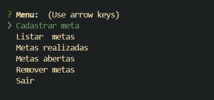
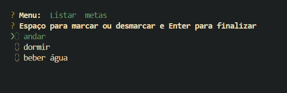
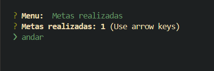

# Gerenciador de Metas 📝

Este é um projeto de gerenciador de metas desenvolvido em JavaScript utilizando o Node.js. O aplicativo é executado diretamente no terminal, permitindo ao usuário gerenciar suas metas de maneira simples e eficiente.
Este projeto foi desenvolvido durante um evento da Rocketseat, que me proporcionou a oportunidade de aprimorar minhas habilidades com JavaScript e Node.js.

## Funcionalidades
- Adicionar metas;
- Listar todas as metas registradas;
- Marcar metas como concluídas;
- Excluir metas.

## Tecnologias Utilizadas

- **Node.js**: Utilizado para criar a aplicação e gerenciar a execução do código JavaScript no servidor.

- **JavaScript**: Linguagem principal utilizada no desenvolvimento do projeto.

## Imagens do funcionamento do programa

## Minha Jornada na Tecnologia

Estou atualmente no segundo período do curso de Análise e Desenvolvimento de Sistemas, e venho explorando o desenvolvimento de software como parte da minha jornada de aprendizado. Tenho experiência em desenvolvimento front-end e estou expandindo meus conhecimentos em JavaScript e Node.js. Este projeto, feito durante um evento da Rocketseat, é um dos meus primeiros passos práticos no mundo da programação back-end. Estou em busca do meu primeiro emprego na área de tecnologia.

